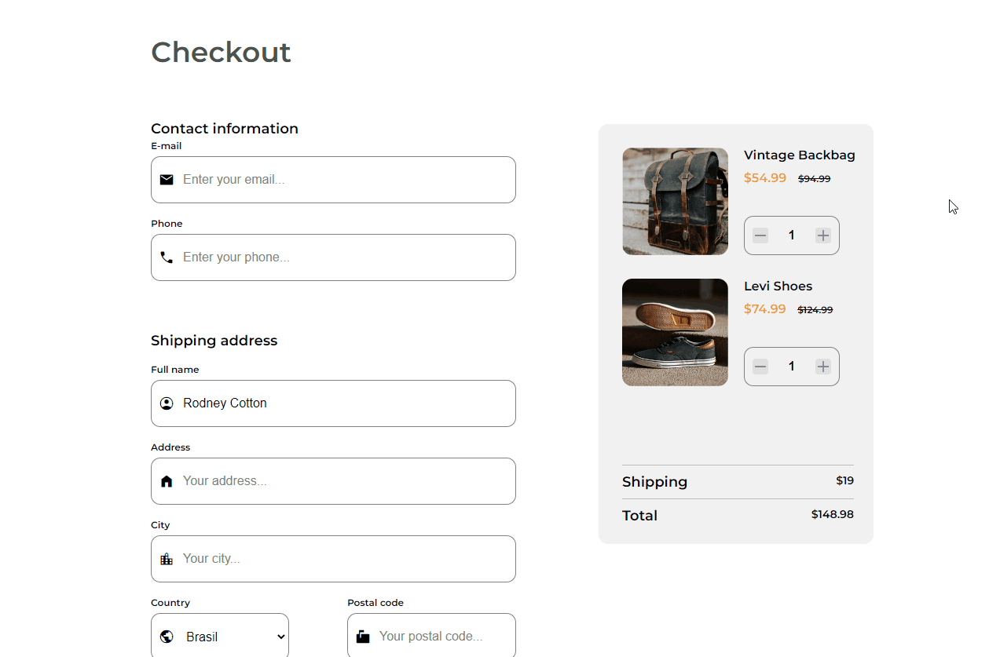
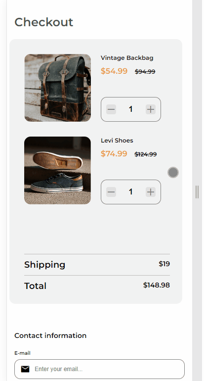

<h1 align="center">Checkout Page</h1>

   Solution for a challenge from  <a href="http://devchallenges.io" target="_blank">Devchallenges.io</a>.

  <h3>
    <a href="https://lucasgmaieski.github.io/checkout-page-devChallenges/index.html">
      Demo
    </a>
     | 
    <a href="https://devchallenges.io/solutions/yKgkmJgke7ZcwzhqX00e">
      Solution
    </a>
     | 
    <a href="https://devchallenges.io/challenges/0J1NxxGhOUYVqihwegfO">
      Challenge
    </a>
  </h3>

<!-- TABLE OF CONTENTS -->

## Table of Contents

- [Overview](#overview)
  - [Built With](#built-with)
- [Features](#features)
- [Contact](#contact)
- [Acknowledgements](#acknowledgements)

<!-- OVERVIEW -->

## Overview
- Descktop

- Mobile
 

### Built With

<!-- This section should list any major frameworks that you built your project using. Here are a few examples.-->

- HTML
- CSS

## Features

<!-- List the features of your application or follow the template. Don't share the figma file here :) -->

This application/site was created as a submission to a [DevChallenges](https://devchallenges.io/challenges) challenge. The [challenge](https://devchallenges.io/challenges/0J1NxxGhOUYVqihwegfO) was to build an application to complete the given user stories.

## Acknowledgements

<!-- This section should list any articles or add-ons/plugins that helps you to complete the project. This is optional but it will help you in the future. For exmpale -->

- [Steps to replicate a design with only HTML and CSS](https://devchallenges-blogs.web.app/how-to-replicate-design/)
- [Style an input type='number' to change the arrows](https://pt.stackoverflow.com/questions/336061/estilizar-um-input-type-number-para-trocar-as-setas)
- [Marked - a markdown parser](https://github.com/chjj/marked)

## Contact

- LinkedIn [@lucasgmaieski](https://www.linkedin.com/in/lucasgmaieski/)
- GitHub [@lucasgmaieski](https://github.com/lucasgmaieski)